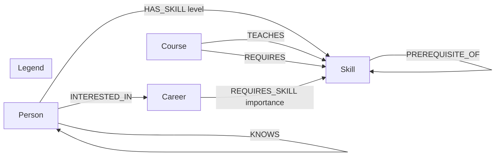

# SkillPath

**Chart the shortest route from what you know to where you want to go.**

SkillPath is a small graph-backed app for career growth. Pick a person, pick a target
career, and it walks a skill-prerequisite graph to build a personalized learning path,
finds mentors in your professional network who already have the skills you're missing,
and recommends courses that close the most gaps at once.

Built for the Wexa AI CognoDB take-home assignment.

- **Backend:** Node.js + Express + TypeScript, talking to CognoDB over Bolt via the
  official `neo4j-driver`
- **Frontend:** React + TypeScript + Vite
- **Database:** [CognoDB](https://console.cognodb.com) (openCypher over Bolt)

---

## Why a graph database?

The whole point of SkillPath is questions about **paths and reach**, not rows:

- *"What's the shortest chain of prerequisite skills between what I know and what a
  Senior Frontend Engineer needs?"* — This is a variable-length path query. In Postgres
  it's a recursive CTE that gets unwieldy once you want the *shortest* path, want to
  stop early when it hits something the person already knows, and want to do this for
  five missing skills at once. In Cypher it's `shortestPath((k)-[:PREREQUISITE_OF*1..6]->(target))`.

- *"Who in my network — or my network's network — already has the skills I'm missing?"*
  — A 2-hop "friend of a friend" traversal with aggregation (count of matching skills,
  fewest hops). In SQL this is a self-join on a `connections` table, twice, with a
  `GROUP BY` — and it gets worse if the hop count becomes configurable. In Cypher it's
  one `MATCH (p)-[:KNOWS*1..2]-(mentor)` pattern.

- *"Which single course covers the most of my remaining gaps?"* — A graph-native
  set-cover query: match courses to the missing-skill set, group, count, sort. Easy
  either way, but it composes naturally with the two queries above because they all
  share the same `Skill` nodes — no extra join tables to keep in sync.

None of these are *impossible* in a relational schema, but they all require either
recursive CTEs, self-joins, or application-side loops to fake the traversal. Here they're
first-class graph patterns. That's the trade the project is built to demonstrate.

## Data model

**Nodes:** `Person`, `Skill`, `Course`, `Career`

**Relationships:**



- **`Skill` `-[:PREREQUISITE_OF]->` `Skill`** — the core chain the route-finder walks.
  e.g. `HTML & CSS` → `JavaScript` → `TypeScript` → `React`.
- **`Person` `-[:HAS_SKILL {level}]->` `Skill`** — what someone already knows, and how well.
- **`Career` `-[:REQUIRES_SKILL {importance}]->` `Skill`** — what a target role needs,
  weighted 1–5.
- **`Course` `-[:TEACHES]->` `Skill`** and **`Course` `-[:REQUIRES]->` `Skill`** — what a
  course teaches, and what you need to already know to take it.
- **`Person` `-[:KNOWS]-` `Person`** — the professional network mentors are found through
  (stored as two directed edges, queried as undirected).
- **`Person` `-[:INTERESTED_IN]->` `Career`** — a person's stated target roles, used to
  default the career picker in the UI.

Seed data: 23 skills across 5 tracks (Frontend, Backend, Data, Product, Leadership),
23 courses, 5 careers, 12 people with realistic skill sets and a connected professional
network — small enough to stay well inside the CognoDB free-tier limits, structured
enough that the multi-hop queries return genuinely different results per person.

## The three graph queries, explained

All three live in [`server/src/routes/graph.ts`](server/src/routes/graph.ts).

### 1. Learning path (`GET /api/graph/learning-path`)

For every skill a career requires that the person doesn't have, finds the shortest
`PREREQUISITE_OF` chain into it — preferring a chain that starts from a skill the person
already knows, and falling back to the nearest "root" skill (one with no prerequisite of
its own) if none of their skills connect to it. Each new skill in the resulting chain is
paired with the best-fit course (fewest additional prerequisites) that teaches it. The
result is an ordered, deduplicated list of milestones — this is what renders as the
transit-line diagram in the UI.

### 2. Mentor finder (`GET /api/graph/mentors`)

```cypher
MATCH (p:Person {id: $personId})
MATCH (c:Career {id: $careerId})-[:REQUIRES_SKILL]->(req:Skill)
WHERE NOT (p)-[:HAS_SKILL]->(req)
WITH p, collect(DISTINCT req.id) AS missingIds
MATCH path = (p)-[:KNOWS*1..2]-(mentor:Person)
WHERE mentor <> p
WITH missingIds, mentor, min(length(path)) AS hops
MATCH (mentor)-[:HAS_SKILL]->(ms:Skill)
WHERE ms.id IN missingIds
WITH mentor, hops, collect(DISTINCT ms { .id, .name }) AS coveredSkills
RETURN mentor { .id, .name, .headline, .avatarSeed } AS mentor, coveredSkills, hops
ORDER BY size(coveredSkills) DESC, hops ASC
LIMIT 6
```

Walks the `KNOWS` network up to 2 hops out, then ranks connections by how many of the
person's career skill-gaps they already cover, closest first.

### 3. Course recommendations (`GET /api/graph/course-recommendations`)

Matches courses against the missing-skill set and ranks by how many gaps each single
course covers — useful when someone would rather take one broad course than five narrow
ones.

## Project structure

```
skillpath/
├── server/                # Express + TypeScript API
│   ├── src/
│   │   ├── index.ts       # app entry point
│   │   ├── lib/db.ts      # CognoDB/Neo4j driver, connection error handling
│   │   ├── routes/        # people, skills, careers, courses, graph
│   │   └── seed/          # seed data + load script
│   └── .env.example
├── client/                 # React + TypeScript + Vite frontend
│   └── src/
│       ├── pages/          # People, Person, Careers, Career, SkillMap
│       ├── components/     # Layout, LearningPathLine, MentorList, ...
│       └── lib/            # typed API client, useAsync hook
└── package.json             # root scripts to run both together
```

## Setup

### 1. Create your CognoDB instance

1. Sign up at [console.cognodb.com/signup](https://console.cognodb.com/signup) (no
   credit card needed for the free tier).
2. Create a free (`c0`) instance and pick a region — it provisions in under a minute.
3. Copy the connection URI (`bolt+s://<instance-id>.databases.cognodb.cloud`) and the
   generated password for the `cognodb` user. **The password is shown once** — save it
   somewhere safe immediately.

### 2. Configure environment variables

```bash
cp server/.env.example server/.env
```

Edit `server/.env`:

```
NEO4J_URI=bolt+s://<your-instance-id>.databases.cognodb.cloud
NEO4J_USER=cognodb
NEO4J_PASSWORD=<your-generated-password>
PORT=4000
```

`server/.env` is git-ignored — never commit real credentials.

### 3. Install and seed

```bash
npm run install:all   # installs server + client deps
npm run seed           # loads the sample dataset into CognoDB
```

The seed script clears any existing data, creates uniqueness constraints on each node
label's `id`, then loads skills, prerequisites, courses, careers, people, skills-known,
professional-network, and interest edges via parameterized `UNWIND` queries.

### 4. Run

```bash
npm run dev
```

This starts the API on `http://localhost:4000` and the frontend (with a dev proxy to the
API) on `http://localhost:5173`. Open the frontend URL, pick a person, and pick a career.

If the database is unreachable, every page shows a clear inline error with a retry
button instead of crashing — try it by pointing `NEO4J_URI` at something invalid.

## Deployment

Any free tier works for the two pieces:

- **API (`server/`):** Render, Fly.io, or Railway free tier. Set the three `NEO4J_*`
  env vars plus `PORT` in the platform's dashboard — never in code.
- **Frontend (`client/`):** Vercel or Netlify free tier. Set `VITE_API_PROXY_TARGET`
  (or point API calls at the deployed API's URL) at build time.

Remember to keep the CognoDB instance running until you hear back — the free tier can
idle down if inactive for too long, so a quick visit to the app before the interview is a
good idea.

## Screenshots

_Add screenshots here once you've seeded the database and run the app locally — the
People directory, a Person page with a route charted, and the skill map are the three
most representative views._
